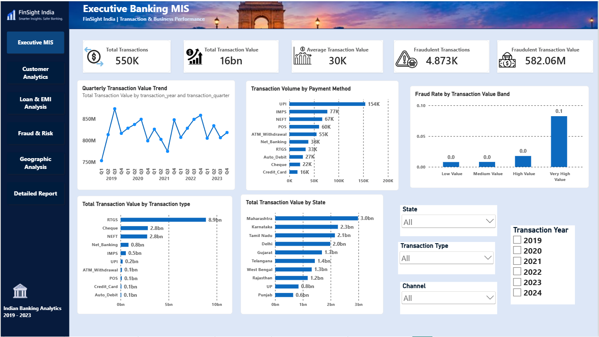
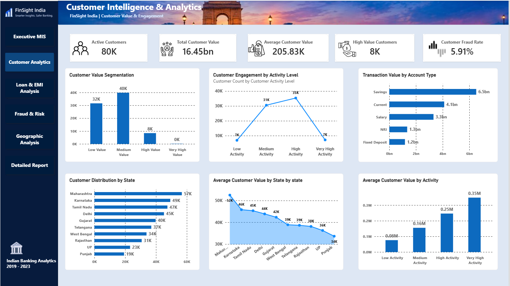
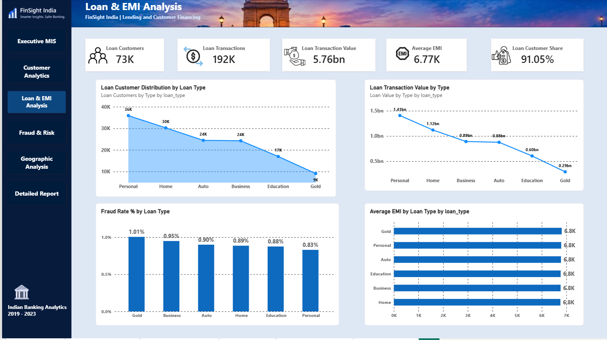
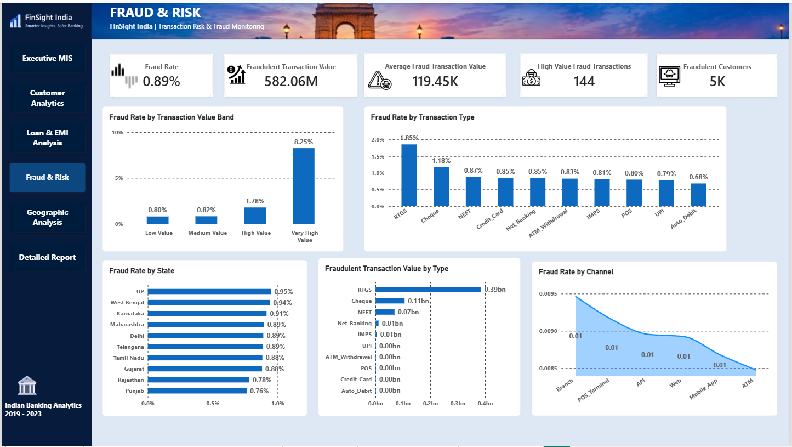
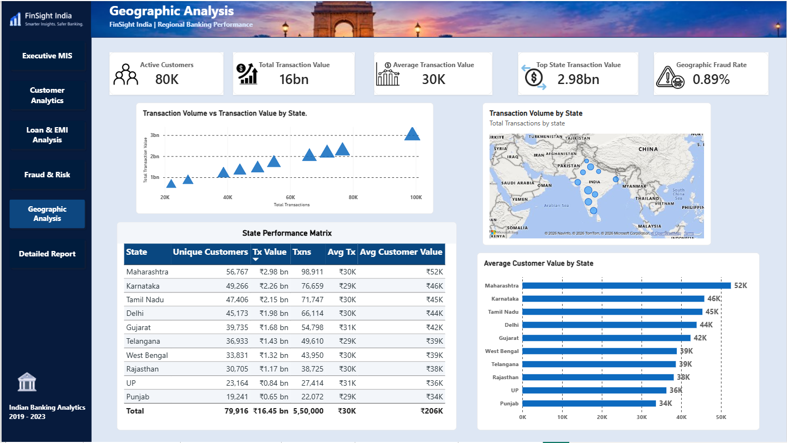
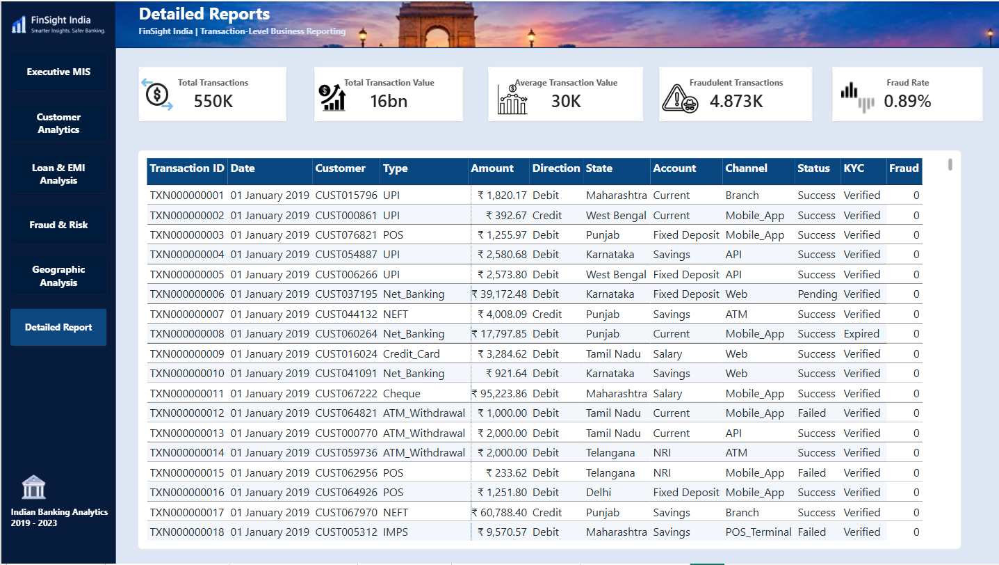

# FinSight India — Banking Performance, Customer Intelligence & Risk Analytics

> An end-to-end banking analytics project using SQL, Python, and Power BI to analyze transaction performance, customer behavior, digital banking adoption, lending activity, geographic performance, and fraud patterns in an Indian banking context.

---

## 📌 Project Overview

**FinSight India** is a comprehensive banking analytics project designed around a real-world Indian retail banking scenario.

The project analyzes **550,000 banking transactions** across customers, account types, payment methods, digital channels, states, loans, and fraud indicators.

The objective is to transform raw transaction data into actionable business insights for banking teams across:

- Banking Performance
- Customer Intelligence
- Digital Banking
- Lending & EMI Analysis
- Fraud & Risk Monitoring
- Geographic Performance
- Transaction-Level Business Reporting

### Business Problem

> **How can a retail bank improve customer engagement and digital payment adoption while monitoring financial performance and identifying transaction-risk patterns?**

---

## 🎯 Project Objectives

- Analyze transaction volume and transaction value
- Understand customer activity and customer value
- Identify high-value customers
- Analyze account-type behavior
- Measure digital banking adoption
- Evaluate loan and EMI activity
- Identify transaction-level fraud patterns
- Compare fraud rates across payment methods, channels, and states
- Analyze geographic banking performance
- Build an executive-level MIS dashboard
- Create transaction-level operational reporting

---

# 📊 Dataset

### Dataset Overview

| Metric | Value |
|---|---:|
| Transactions | 550,000 |
| Unique Customers | 79,916 |
| Columns | 20 |
| Transaction Dates | 1,827 |
| States | 10 |
| Merchant Categories | 15 |
| Transaction Types | 10 |
| Channels | 6 |
| Account Types | 5 |

### Time Period

**January 2019 – January 2024**

> January 1, 2024 contains only partial-year data. Therefore, full-year trend comparisons primarily use 2019–2023.

### Main Dataset Fields

- `transaction_id`
- `customer_id`
- `transaction_date`
- `transaction_time`
- `account_type`
- `transaction_type`
- `transaction_amount`
- `transaction_direction`
- `account_balance`
- `merchant_category`
- `state`
- `credit_score`
- `has_loan`
- `loan_type`
- `emi_amount`
- `transaction_status`
- `channel`
- `kyc_status`
- `is_fraud`
- `transaction_hour`

---

# 🛠️ Tools & Technologies

## SQL

- MySQL
- Data quality auditing
- Data validation
- Aggregations
- Subqueries
- Customer segmentation
- Fraud analysis
- Business KPI analysis
- Data transformation

## Python

- Python
- Pandas
- NumPy
- Exploratory Data Analysis
- Data quality analysis
- Descriptive statistics
- Outlier analysis
- Customer analysis
- Fraud pattern analysis

## Power BI

- Data modeling
- DAX
- KPI development
- Interactive dashboards
- Slicers
- Conditional formatting
- Data visualization
- Page navigation
- Drill-through reporting
- Transaction-level reporting

---

# 🔄 End-to-End Workflow

```text
Raw CSV Dataset
       ↓
Data Quality Audit
       ↓
MySQL Data Import
       ↓
SQL Data Cleaning & Transformation
       ↓
SQL Business Analysis
       ↓
Python Exploratory Data Analysis
       ↓
Power BI Data Model
       ↓
DAX Measures & Calculations
       ↓
Interactive Power BI Dashboard
       ↓
Business Insights
````

---

# 🧹 Data Quality Audit

Before performing business analysis, the dataset was systematically audited for data quality issues.

### Checks Performed

* Duplicate transaction IDs
* Missing values
* Invalid credit scores
* Invalid transaction amounts
* Transaction date range
* Transaction-hour consistency
* Loan data consistency
* Fraud distribution
* Account balance validation
* Transaction status distribution
* Channel distribution
* State distribution
* Merchant category distribution
* Transaction value outliers

### Key Data Quality Finding

A total of **19,422 transactions** contained:

```text
has_loan = 1
loan_type = NULL
```

However, all affected records contained valid EMI values.

Rather than blindly imputing the missing loan type, the issue was preserved and documented as a **data quality issue** for further investigation.

---

# 📈 SQL Business Analysis

SQL was used to create the analytical data layer and answer practical banking business questions.

## Banking Performance

* Annual transaction volume
* Annual transaction value
* Payment method performance
* Debit vs Credit analysis
* Account-type performance
* State-level transaction performance
* Transaction trends

## Customer Analytics

* Customer transaction activity
* Customer value segmentation
* High-value customer identification
* Customer transaction frequency
* Customer value by state
* Account-type behavior

## Digital Banking

* Digital vs offline transaction mix
* Mobile App usage
* Web banking usage
* API transactions
* Digital channel transaction value
* Yearly digital transaction share

## Lending & EMI

* Loan vs non-loan customers
* Loan transaction volume
* Loan transaction value
* Loan type performance
* Average EMI
* Loan-related fraud analysis

## Fraud & Risk

* Overall fraud rate
* Fraud by transaction type
* Fraud by channel
* Fraud by state
* Fraud by account type
* Fraud by transaction value
* Fraudulent transaction value

---

# 🐍 Python Exploratory Data Analysis

Python was used to independently explore and validate the dataset before developing the Power BI dashboard.

### EDA Areas

* Dataset structure
* Data types
* Missing-value analysis
* Duplicate analysis
* Descriptive statistics
* Transaction amount distribution
* Customer activity
* Account-type behavior
* Payment-method analysis
* Digital banking analysis
* Fraud analysis
* Transaction-value outliers
* Customer segmentation

### Dataset Statistics

```text
Dataset Shape: 550,000 × 20

Unique Transactions: 550,000

Unique Customers: 79,916

Average Transaction Amount: ~₹29,907

Maximum Transaction Amount: ₹1 Crore

Fraudulent Transactions: 4,873

Overall Fraud Rate: ~0.89%
```

---

# 📊 Power BI Dashboard

The final Power BI report contains **6 interactive pages** designed for different banking analytics use cases.

---

## 1️⃣ Executive MIS

### Purpose

Provides an executive-level overview of banking performance and transaction risk.

### Key Performance Indicators

* Total Transactions
* Total Transaction Value
* Average Transaction Value
* Fraudulent Transactions
* Fraudulent Transaction Value

### Key Visuals

* Quarterly Transaction Value Trend
* Transaction Volume by Payment Method
* Transaction Value by Payment Method
* Fraud Rate by Transaction Value Band
* Transaction Value by State

### Business Use Case

Designed for management teams to quickly monitor transaction activity, financial value, payment-method performance, and fraud exposure.

---

## 2️⃣ Customer Intelligence & Analytics

### Purpose

Analyzes customer value, activity, engagement, and geographic distribution.

### Key Performance Indicators

* Active Customers
* Total Customer Value
* Average Customer Value
* High Value Customers
* Customer Fraud Rate

### Key Visuals

* Customer Value Segmentation
* Customer Engagement by Activity Level
* Transaction Value by Account Type
* Customer Distribution by State
* Average Customer Value by State
* Average Customer Value by Activity Level

### Business Use Case

Helps identify customer segments, understand engagement patterns, and analyze customer value across different regions.

---

## 3️⃣ Loan & EMI Analysis

### Purpose

Analyzes lending activity, loan types, customer financing, EMI behavior, and loan-related risk.

### Key Performance Indicators

* Loan Customers
* Loan Transactions
* Loan Transaction Value
* Average EMI
* Loan Customer Share

### Key Visuals

* Loan Customer Distribution by Loan Type
* Loan Transaction Value by Type
* Fraud Rate by Loan Type
* Average EMI by Loan Type

### Business Use Case

Provides visibility into loan customer behavior, loan-type performance, EMI patterns, and associated transaction risk.

---

## 4️⃣ Fraud & Risk

### Purpose

Provides transaction-level fraud and risk monitoring.

### Key Performance Indicators

* Fraud Rate
* Fraudulent Transaction Value
* Average Fraud Transaction Value
* High Value Fraud Transactions
* Fraudulent Customers

### Key Visuals

* Fraud Rate by Transaction Value Band
* Fraud Rate by Transaction Type
* Fraud Rate by Channel
* Fraud Rate by State
* Fraudulent Transaction Value by Type

### Business Use Case

Helps identify transaction categories and segments where fraud monitoring may require additional attention.

> Fraud patterns shown in this project are descriptive observations from the dataset and should not be interpreted as proof of causation.

---

## 5️⃣ Geographic Analysis

### Purpose

Analyzes banking performance across Indian states.

### Key Metrics

* Active Customers
* Total Transaction Value
* Average Transaction Value
* Top State Transaction Value
* Geographic Fraud Rate

### Key Visuals

* Transaction Value by State
* Transaction Volume by State
* Average Transaction Value by State
* Average Customer Value by State
* State Performance Matrix
* Geographic Transaction Map

### Business Use Case

Helps compare regional banking activity, customer distribution, transaction value, and geographic risk patterns.

---

## 6️⃣ Detailed Report

### Purpose

Provides transaction-level operational reporting.

### Included Fields

* Transaction ID
* Date
* Customer
* Transaction Type
* Amount
* Direction
* State
* Account Type
* Channel
* Status
* KYC Status
* Fraud Flag

### Business Use Case

Designed for detailed transaction investigation and operational reporting.

---

# 💡 Key Business Insights

## 1. Digital Banking Represents the Majority of Transaction Activity

Digital channels accounted for approximately **67% of transaction volume** during 2019–2023.

Mobile App transactions represented the largest share of digital activity, followed by Web and API transactions.

---

## 2. RTGS Has the Highest Transaction Value

RTGS generated approximately **₹8.9B** in transaction value despite having significantly fewer transactions than high-volume methods such as UPI and IMPS.

This highlights the difference between **transaction volume and transaction value**.

---

## 3. Higher Transaction Values Show Higher Fraud Rates

Fraud rates increased across higher transaction-value bands within the dataset.

The highest transaction-value band recorded a fraud rate of approximately **8.25%**, compared with around **0.8%** for lower-value transactions.

> This is a descriptive pattern in the dataset and does not establish causation.

---

## 4. RTGS Shows the Highest Fraud Rate Among Transaction Types

RTGS recorded a fraud rate of approximately **1.85%**, followed by Cheque at approximately **1.18%**.

The remaining transaction types showed comparatively narrower fraud-rate differences.

---

## 5. Maharashtra Has the Highest Transaction Value

Maharashtra generated approximately **₹2.98B** in transaction value during the analyzed period, followed by Karnataka and Tamil Nadu.

---

## 6. Customer Value Is Distributed Across Multiple Segments

Customers were segmented into:

* Low Value
* Medium Value
* High Value
* Very High Value

This segmentation provides a way to analyze customer behavior beyond simple transaction counts.

---

## 7. Loan Activity Represents a Significant Customer Segment

Approximately **73K customers** appear in loan-related transactions, with loan-related transaction value of approximately **₹5.76B**.

Personal and Home loans account for substantial portions of loan activity in the dataset.

---

# 📌 Business Use Cases

## Management Reporting

* Executive MIS
* KPI monitoring
* Regional performance
* Payment-method performance
* Transaction monitoring

## Customer Analytics

* Customer segmentation
* High-value customer identification
* Customer engagement analysis
* Geographic customer analysis
* Customer value analysis

## Digital Banking

* Digital channel adoption
* Mobile banking analysis
* Web banking analysis
* Digital vs offline behavior

## Risk Analytics

* Fraud monitoring
* High-value transaction monitoring
* Payment-method risk analysis
* Geographic fraud analysis
* Fraudulent transaction value analysis

## Lending Analytics

* Loan customer analysis
* Loan-type performance
* EMI analysis
* Loan-related fraud monitoring

---

# 📁 Project Structure

```text
FinSight-India/
│
├── data/
│   └── indian_banking_transactions.csv
│
├── sql/
│   ├── data_quality_audit.sql
│   ├── data_cleaning.sql
│   └── business_analysis.sql
│
├── python/
│   └── finsight_india_eda.ipynb
│
├── powerbi/
│   └── FinSight_India.pbix
│
├── images/
│   ├── executive-mis.png
│   ├── customer-analytics.png
│   ├── loan-emi-analysis.png
│   ├── fraud-risk.png
│   ├── geographic-analysis.png
│   └── detailed-report.png
│
└── README.md
```

---

# 📷 Dashboard Preview

## Executive MIS



---

## Customer Intelligence & Analytics



---

## Loan & EMI Analysis



---

## Fraud & Risk



---

## Geographic Analysis



---

## Detailed Report



---

# 🧠 Analytical Skills Demonstrated

* Data Cleaning
* Data Quality Auditing
* Exploratory Data Analysis
* SQL Analysis
* Customer Segmentation
* Banking Analytics
* Financial Analytics
* Fraud Analytics
* Risk Analytics
* Geographic Analysis
* Digital Banking Analysis
* Lending Analytics
* KPI Development
* Business Analysis
* MIS Reporting
* Data Visualization
* Dashboard Development
* Business Insight Generation

---

# 💻 Technical Skills Demonstrated

### SQL

* SELECT
* WHERE
* GROUP BY
* HAVING
* ORDER BY
* JOINs
* Subqueries
* Aggregations
* CASE statements
* Data transformation
* Business metrics

### Python

* Pandas
* NumPy
* Data profiling
* Data validation
* Statistical analysis
* EDA
* Outlier detection
* Segmentation

### Power BI

* Data modeling
* DAX measures
* Calculated columns
* KPI cards
* Bar charts
* Column charts
* Line charts
* Tables
* Maps
* Slicers
* Conditional formatting
* Page navigation
* Interactive reporting

---

# 📈 Key Project Metrics

| Metric                    |   Result |
| ------------------------- | -------: |
| Total Transactions        |     550K |
| Unique Customers          |    79.9K |
| Transaction Value         | ~₹16.45B |
| Average Transaction Value |  ~₹29.9K |
| Fraudulent Transactions   |    4,873 |
| Fraud Rate                |   ~0.89% |
| Loan Customers            |     ~73K |
| Loan Transaction Value    |  ~₹5.76B |
| Digital Transaction Share |     ~67% |

---

# ⚠️ Analytical Notes

* The dataset contains a partial period for January 2024.
* Full-year trend comparisons primarily use 2019–2023.
* Fraud rates represent descriptive patterns within the dataset.
* Small transaction groups can produce unstable fraud-rate percentages.
* Missing loan types associated with `has_loan = 1` were documented rather than arbitrarily imputed.
* High-value transactions were retained because they represent potentially meaningful financial activity rather than automatically being treated as errors.

---

# 🚀 Project Outcome

FinSight India demonstrates an end-to-end analytics workflow that transforms raw banking transaction data into an interactive business intelligence solution.

The project combines:

```text
SQL
+
Python
+
Power BI
+
Business Analysis
+
Financial Analytics
+
Risk Analytics
```

to create a decision-support environment for analyzing:

**Banking Performance → Customer Intelligence → Lending → Fraud & Risk → Geographic Performance → Detailed Reporting**

---

# 👨‍💻 Author

## Amit Sharma

**MSc Computer Science | Data Analytics**

### Skills

* SQL
* Power BI
* Python
* Excel
* Data Visualization
* Business Analysis
* MIS Reporting

### Areas of Interest

* Data Analytics
* Business Intelligence
* Business Analysis
* MIS Analytics
* Financial Analytics
* Customer Analytics

---

# ⭐ Project Summary

**FinSight India** is an end-to-end banking analytics project built to demonstrate practical Data Analyst, Business Analyst, and MIS Analyst capabilities.

```text
Raw Banking Data
       ↓
Data Quality Audit
       ↓
MySQL
       ↓
SQL Business Analysis
       ↓
Python EDA
       ↓
Power BI
       ↓
Interactive Dashboard
       ↓
Business Insights
```

**550,000 transactions.
79,916 customers.
6 Power BI analytical pages.
SQL + Python + Power BI.**

---

```
```
